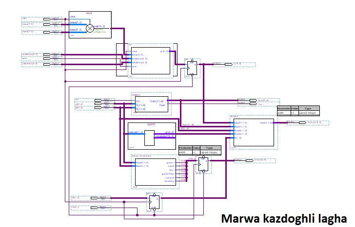
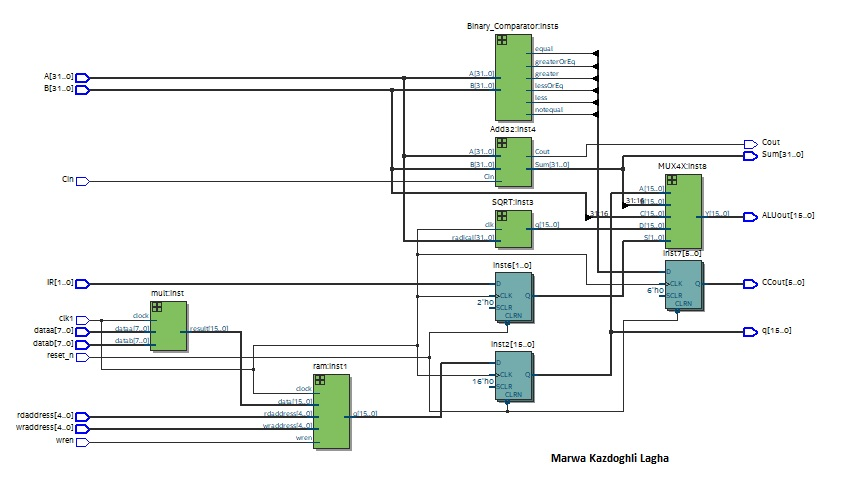
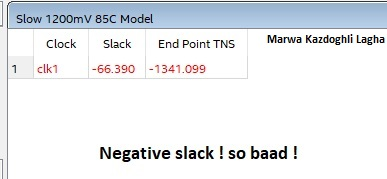
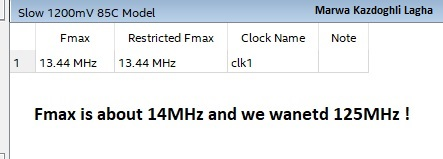
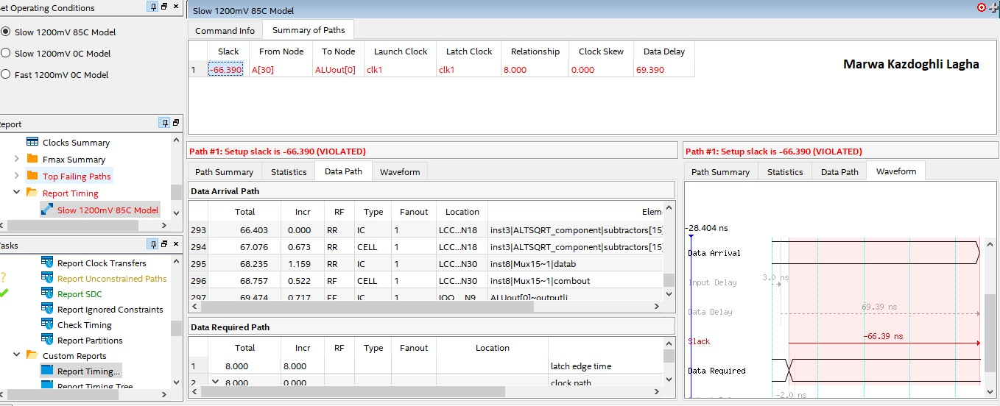
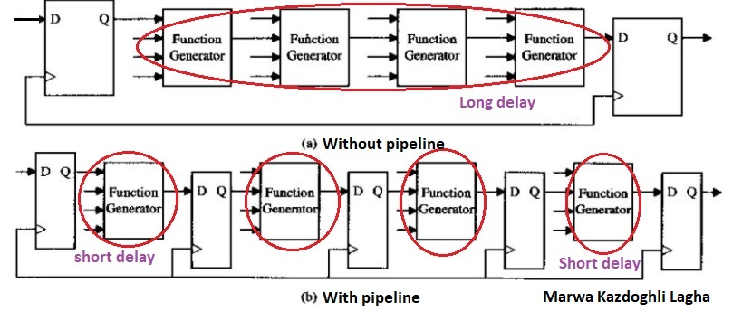
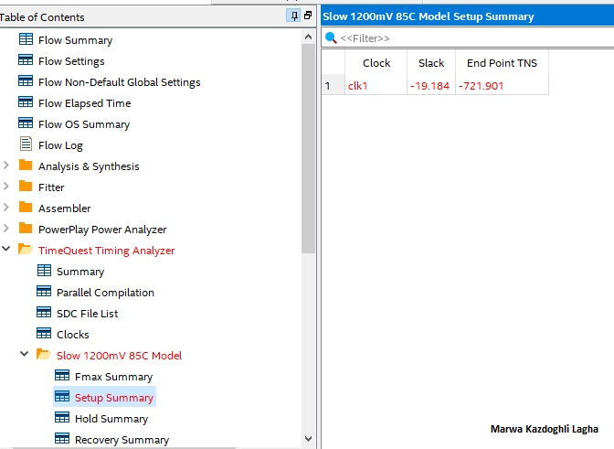
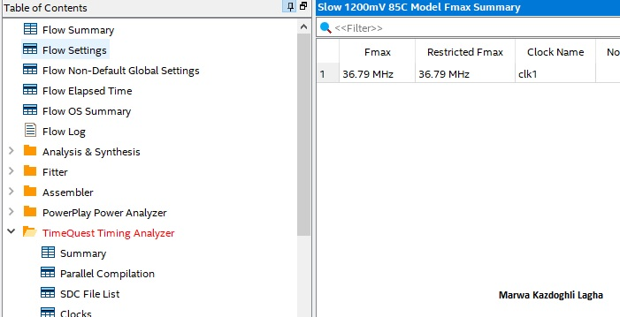
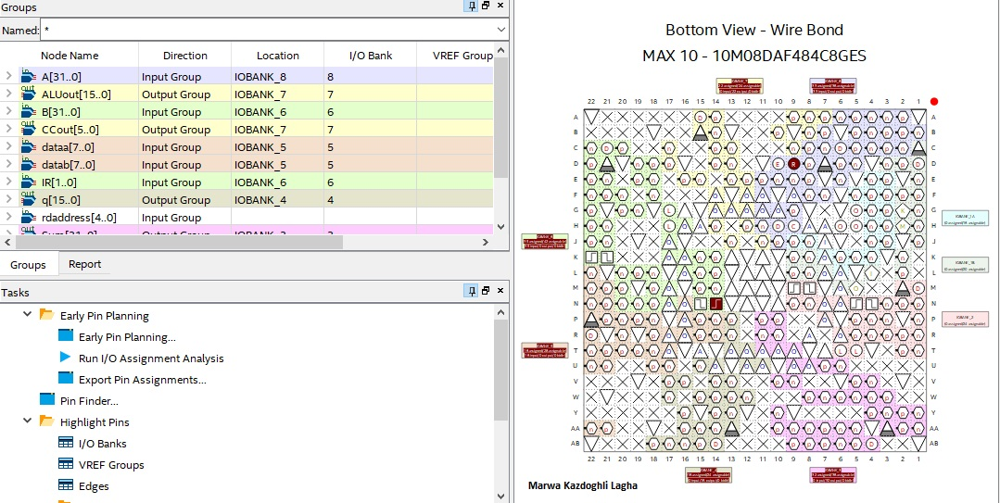
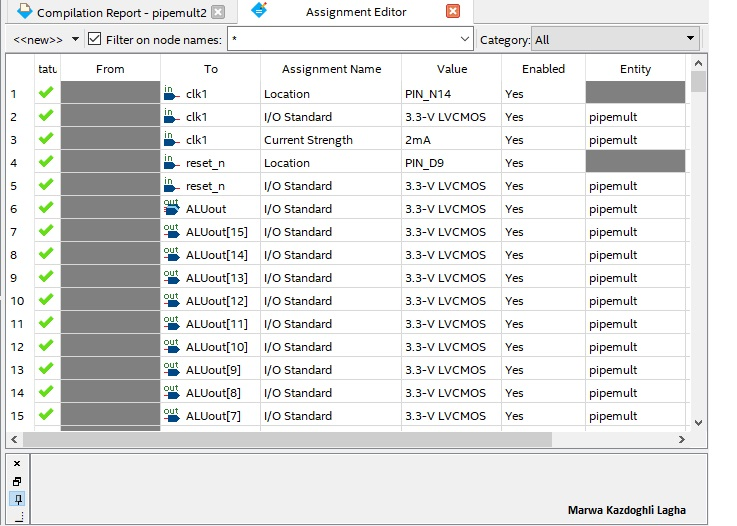

# Create a project in Quartus Prime 

## Objective : Create a basic ALU
🔴 We will see : 
* ALU Design
* RTL view of the ALU design
* Update TimeQuest timing analysis
* Pin Assignements via pin planner or the assignement editor

## ALU Design

The figure bellow shows a schematic representation of the top-level design file you will be using today. It consists
of a basic ALU design. 

## RTL view of the ALU design

The RTL Viewer allows you to view a logical representation of an analyzed design
graphically. It is a very helpful tool for debugging HDL synthesis results. 

This is a graphical view displaying the logical representation of the design. Currently it shows the I/O, the instantiation of
the mult and ram subdesigns, and an additional set of output registes. Notice the
registers are external to the memory block per the original design.

Note that in the RTL Viewer that the Hierarchy List shows how you can descend
down into the ram subdesign. For each hierarchical level, you can also see the
names of its pins and nets. 

 ## Update TimeQuest timing analysis

Design problem encountred: Unconstrained paths

:arrow_right: Many inputs and outputs were added when the design was upgraded. TimeQuest is then used to add constraints to all the new paths.

The input delay assumes that an external device has an output Flip-Flop clocked by the clock which delivers data to the input of the FPGA. The ouput delay assumes that the output is driving
the input Flip-Flop of another external circuit that is also referenced to the clock. There is one clock delay to move the data from the input of the FPGA to the output. In this design, there is 2 circuits
with large combinatorial logic delay : the square root IP block and the add_32 circuit.  

:arrow_right:  We need to determine where the longest path is, to be able to improve it.

:round_pushpin: Timing report
If you scroll down the data arrival path, you will see that the path goes through square root block, and that the worst delay comes from the SQRT function. 

:interrobang: What can be done to improve this ?

Solution: Using pipeline !

Why using pipeline: 
Improving the throughput (throughput), the pipeline design method has high performance computing, often requires extensive system has been widely used, such as CPU, high-performance DSP.
Before the streamlined design, the system can only use a slower clock, after streamlined design, the system clock can be greatly accelerated ( see Figure bellow). 

:white_circle: The solution is to use pipelining in IP blocks to improve timing and the resulted output is:

The slack has improved to negative 19 nanoseconds three times better than before, and the Fmax is now arround 37 MHz.
Much improved.
Via Timing report, the limiting critical path isnow wihtin the add_32 blcok and not the SQRT function.

## Pin Assignements via pin planner or the assignement editor

In altera FPGAs, the pin assignements can be performed in one of 5 ways:

* Using Quartus GUI tools, either the Pin planner or Assignement Editor
* Importing from an SDC file, or Excel speadsheed file
* Writing directives in an HDL ( verilog or VHDL ) file
* Automating by use of a TCL script
* Importing from a PCB layout CAD tool

Note that each pin shape, color and text provide information about the properties of that pin. 
For example, the unique colors help to identify each IO bank 
Triangles represent power and ground pins
Circles represent special functions
Squares are clock pins
Pentagones are for JPEG pins
hexagones for general IO pins

Pin assignement could be handeled via the pin planner:

or the assignement editor:

## References:

* Wikipedia: https://en.wikipedia.org/wiki/Flip-flop_(electronics)
* Images: https://learnabout-electronics.org ; https://dcaclab.com/
* Course content can be found at Coursera: https://www.coursera.org/learn/fpga-hardware-description-languages
